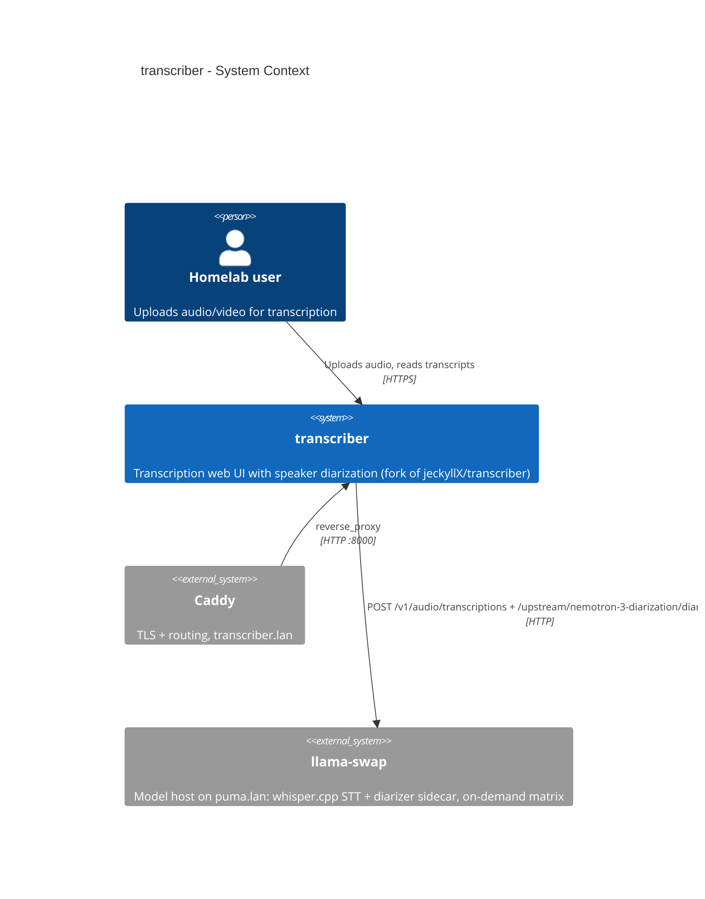

# transcriber — System Context

Transcription web UI with speaker diarization, deployed on puma.lan (`https://transcriber.lan`). App: fork `oleksii-honchar/whisper-webui` of jeckyllX/transcriber.

## Diagram

## Levels

- [[architectures/transcriber/containers/_index|Containers]] — app + diarizer sidecar
- [[architectures/transcriber/components/_index|Components]] — inside the app container
- Code level: not documented (class-level detail is LSP's job; key contracts in the component node)

## Related

- Specification: [[specifications/0001-transcriber-service.spec]]
- Key decisions: [[decisions/0001-reuse-llama-swap-whisper-stt.decision]], [[decisions/0013-llama-swap-managed-sidecar.decision]]
