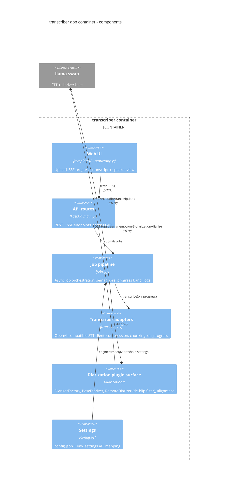

# Components inside the transcriber app container

## Diagram

## Key contracts (code-level anchors)

- `BaseDiarizer` (`diarization/base.py`): `is_available()`, `diarize(audio, num_speakers, cluster_threshold) -> DiarizationResult{num_speakers, intervals[]}`.
- `DiarizerFactory` (`diarization/factory.py`): registry; registers `RemoteDiarizer` only; `get_diarizer(name="remote")`; `list_engines()` feeds `/api/status`.
- `RemoteDiarizer` (`diarization/remote_diarizer.py`): HTTP client + DEC-0015 de-blip filter.
- `align_speakers_to_segments` (`diarization/alignment.py`): maps diarization onto STT segments.

All verified against `diarization/` at `b7a4f03`.
