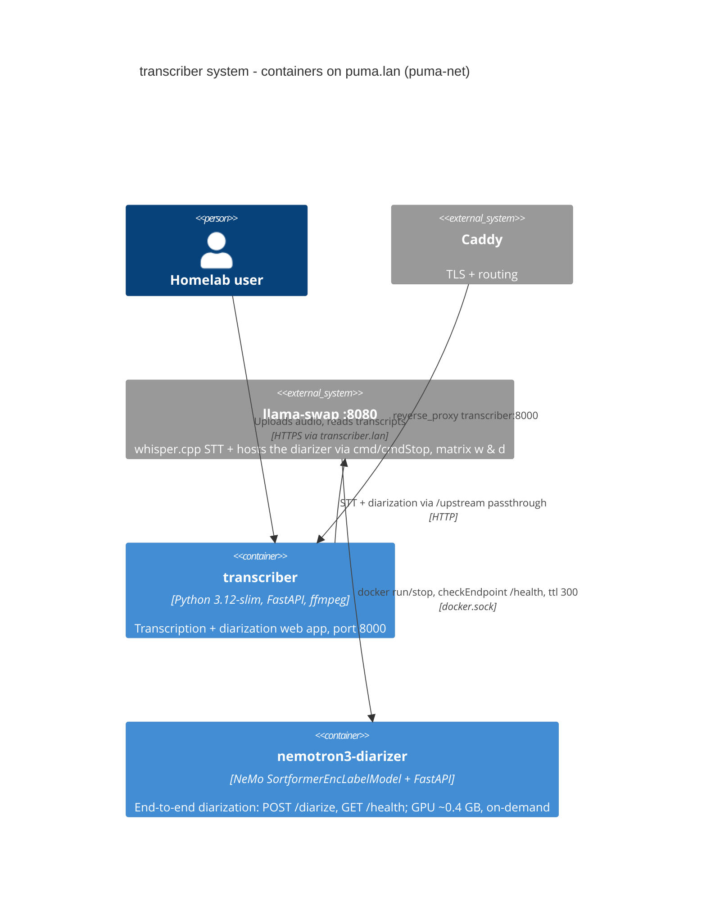

# Container: transcriber

## Diagram

## Elements

| ID | Name | Type | Technology | Description |
|----|------|------|-----------|-------------|
| transcriber_app | transcriber | Container | Python 3.12-slim, FastAPI, ffmpeg, vanilla JS | Web UI + job pipeline; image `tuiteraz/whisper-webui` built from the fork |
| llama_swap | llama-swap | System_Ext | llama-swap + whisper.cpp | STT backend + diarizer host on `puma-net` |
| diarizer_sidecar | nemotron3-diarizer | Container | NeMo, FastAPI | See [[architectures/transcriber/containers/0002-nemotron3-diarizer-sidecar.container]] |

## Notes

- Volumes: `transcriber-models` (STT-only since DEC-0016), `transcriber-config`, outputs.
- Env via Infisical `/transcriber`; dummy `OPENAI_API_KEY` required ([[memories/0001-dummy-openai-api-key-required.memory]]).
- ⚠️ compose currently references `tuiteraz/whisper-webui:latest` — spec intent was pinned commit (open decision).
